# ScoutChase

**AI-assisted prospecting and outreach for sales teams, job seekers, and recruiters.**

Scout researches and ranks the companies worth contacting. **You decide who moves forward.** Chase drafts outreach, helps manage replies, and supports follow-up without removing the human approval step.

[Website](https://scoutchase.com) · **Status:** Working prototype · **Source:** Private

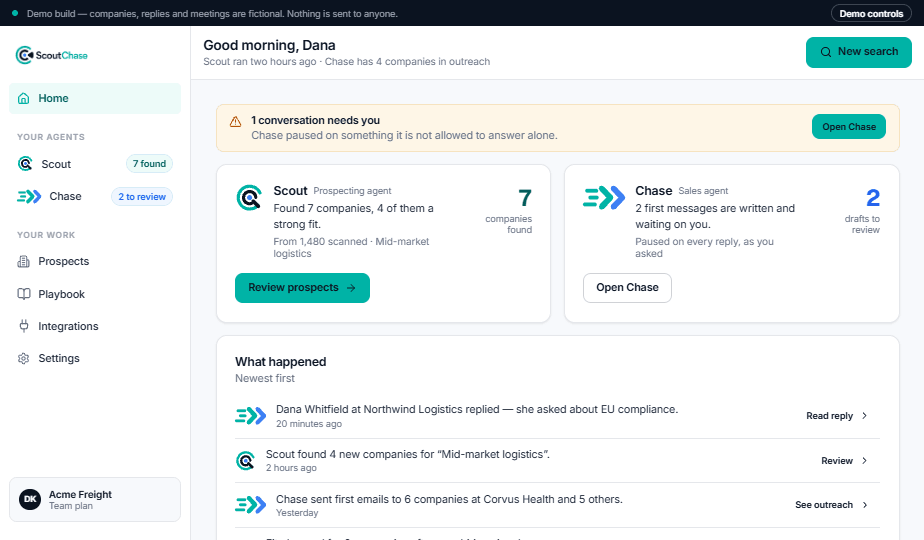

---

## What is ScoutChase?

ScoutChase is a working product prototype built around two AI-assisted agents and one deliberate human decision point.

Most prospecting tools push users toward one of two bad extremes:

- hand over a huge list and make the user do the research manually, or
- automate outreach at volume and risk turning prospecting into spam.

ScoutChase takes a different approach.

It starts with a **playbook** describing what the user sells or is looking for, who is a good fit, what signals matter, and what claims are allowed. Scout uses that context to research and rank opportunities. The user approves the ones worth pursuing. Chase then helps draft and manage the outreach.

```text
PLAYBOOK
   ↓
SCOUT SEARCH
   ↓
RANKED RESULTS + REASONS
   ↓
YOUR APPROVAL
   ↓
CHASE DRAFTS
   ↓
OUTREACH
   ↓
REPLIES
   ↓
QUALIFIED / HANDOFF
```

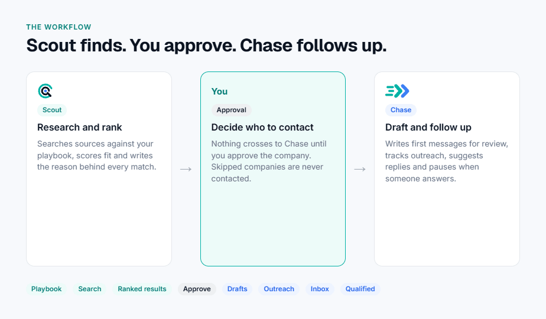

---

## The core idea

**Do the research before anyone gets contacted, and keep a person in charge of the decisions that matter.**

### Scout

Scout is the research and prospecting agent. It interprets the playbook, searches available sources, evaluates fit, ranks matches, and explains *why* each company or opportunity is worth attention.

### You

The user controls the approval boundary. Nothing moves from Scout to Chase until it is explicitly approved.

### Chase

Chase is the outreach and follow-up agent. It drafts first messages, supports review, tracks outreach, suggests replies, and pauses when a conversation needs human judgment.

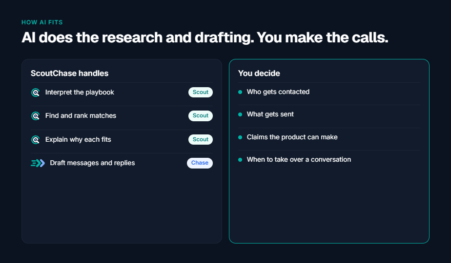

---

## From a brief to a ranked list

### 1. Build the playbook

Onboarding captures the context both agents need: what you sell or are looking for, who a good fit is, common problems, geography, positioning, objections, and communication boundaries.

Scout uses the playbook to judge fit. Chase uses it to draft messages and stay within the user's rules.

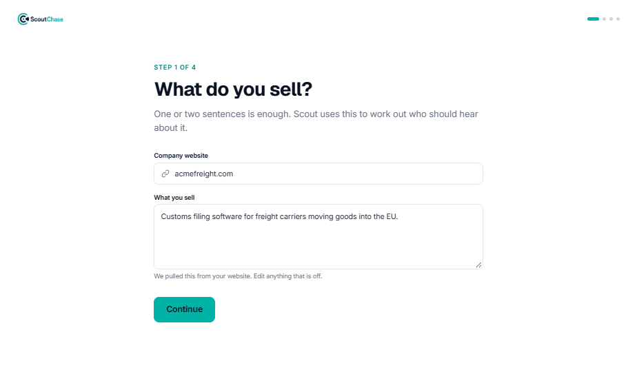

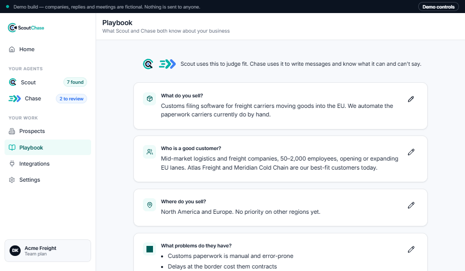

### 2. Send Scout out

The user describes who Scout should look for in plain language and can narrow the search with simple filters such as company size, geography, and result count.

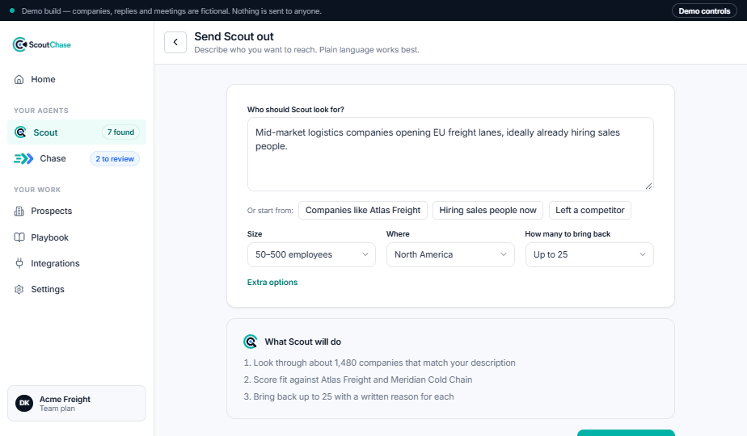

### 3. Review ranked results

Scout returns a short list rather than an undifferentiated database dump. Results are grouped by fit and include written reasons so the user can understand the recommendation instead of trusting a mystery score.

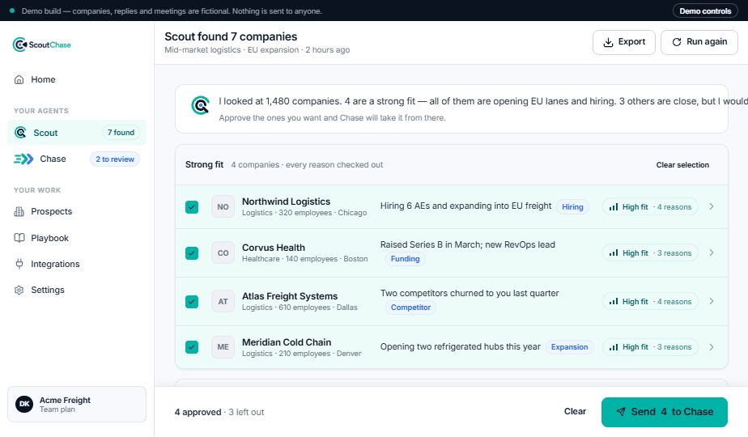

Opening a company shows the evidence behind the match, the relevant signals, people connected to the opportunity, and the first message Chase would draft.

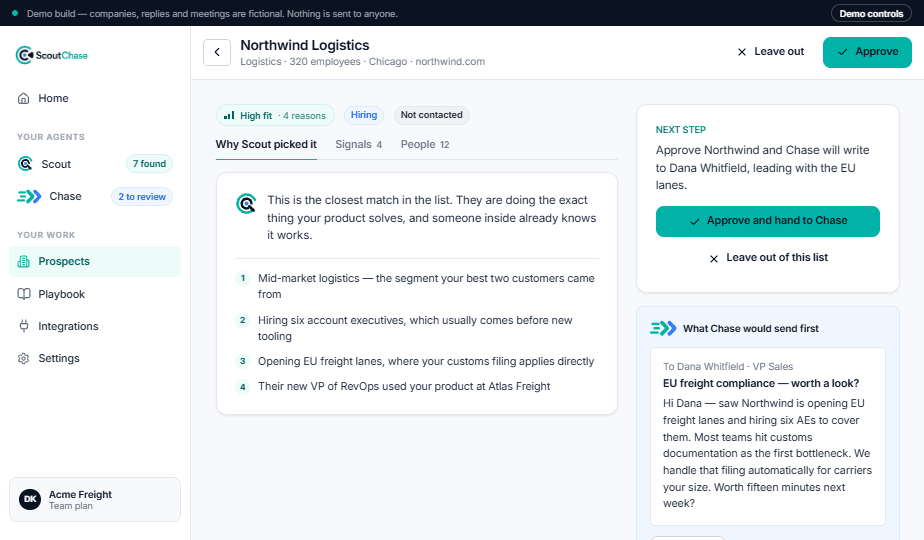

---

## Scout → approval → Chase

Approval is a first-class part of the workflow, not a hidden checkbox.

When companies are handed from Scout to Chase, the user can see how many companies and contacts are included and choose whether each first message must be reviewed before anything is sent.

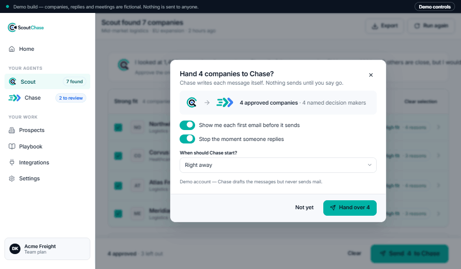

Chase then creates a review queue. Drafts can be reviewed, edited, rewritten, approved, or skipped. A skipped company is not contacted.

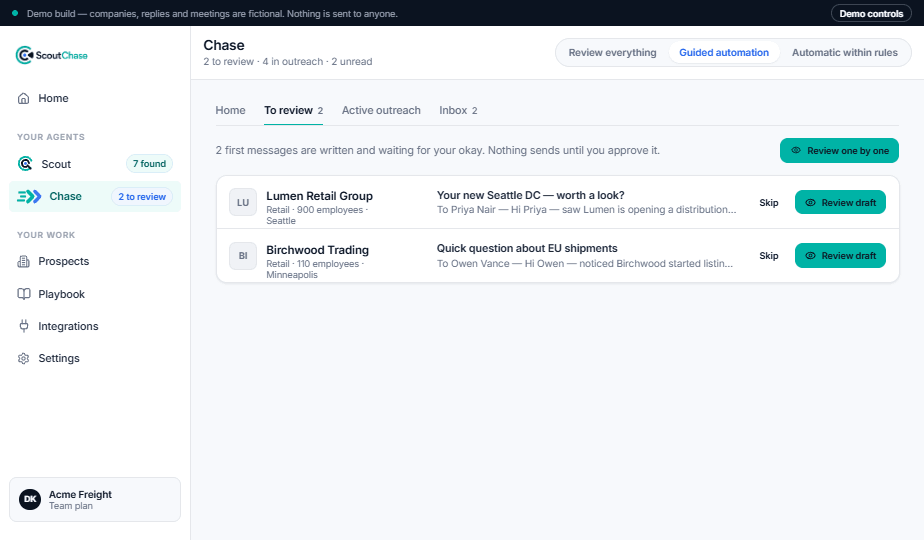

Approved prospects then move through the working pipeline as outreach progresses.

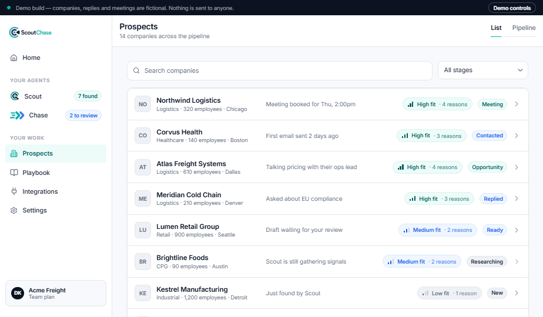

The dashboard keeps the two agents visible as separate responsibilities: Scout finds opportunities; Chase manages approved outreach and conversations.


---

## One workflow, three playbooks

The same **Scout → approve → Chase** loop can support different goals. What changes is the playbook and the target of the research.

| Use case | Scout looks for | Chase supports |
|---|---|---|
| **Sales** | Companies that fit the product and show useful buying signals | Outreach to the relevant decision-maker |
| **Job search** | Roles and companies worth pursuing from job and ATS sources | Outreach to the hiring team |
| **Recruiting** | Companies that are hiring and relevant search opportunities | Outreach around the active search |

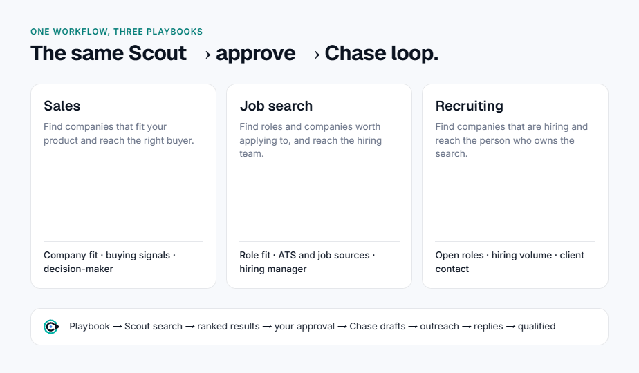

---

## How AI fits

ScoutChase is intentionally not designed around “let the AI do everything.”

AI handles the repetitive work where it is useful:

- interpreting the playbook
- researching opportunities
- matching and ranking
- explaining fit
- drafting outreach
- drafting suggested replies

The user keeps control over the decisions that carry reputational or business risk:

- who gets contacted
- what gets sent
- what claims the product is allowed to make
- when to take over a conversation

That human-in-the-loop boundary is part of the product design, not a temporary limitation.

---

## Product architecture

ScoutChase is a **working prototype with a real application layer, authentication, persistent data, workflow logic, and automated testing**.

| Layer | Technology |
|---|---|
| Application | Next.js · React · TypeScript |
| Styling | Tailwind CSS |
| Authentication | Clerk |
| Database | PostgreSQL |
| ORM | Prisma |
| Testing | Vitest · Playwright |
| Deployment | Docker configuration |

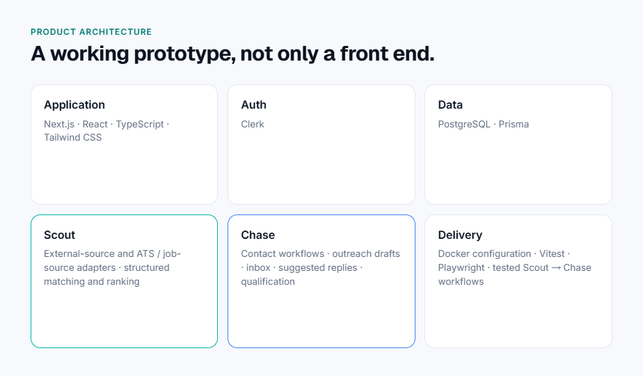

The current prototype includes:

- external-source and ATS/job-source adapters
- structured matching and ranking logic
- Client Prospecting and Job Search playbooks
- company and contact workflows
- outreach draft generation
- explicit Scout → Chase handoff
- review queues
- inbox and suggested-reply workflows
- qualification and pipeline progression
- tested Scout → Chase workflows

---

## What works today

ScoutChase is not just a UI concept. The current prototype demonstrates the core product loop end to end:

1. define a playbook
2. run a Scout search
3. receive ranked results with reasons
4. inspect the company and signals
5. approve selected opportunities
6. hand approved companies to Chase
7. review outreach drafts
8. track prospects and conversations through the workflow

The screenshots in this repository use fictional demo data and are intended to show the product experience without exposing private customer or prospect information.

---

## What comes next

The next development areas are focused on making the prototype more useful in real-world workflows rather than simply adding more UI.

- broader company-first discovery
- stronger decision-maker enrichment
- deeper external integrations
- production email and outreach infrastructure
- stronger production multi-tenant controls
- operational monitoring and security hardening
- billing and account administration

---

## Why I built ScoutChase

I built ScoutChase because prospecting and job searching both suffer from the same basic problem: there is too much information, too little context, and too much repetitive manual work.

The interesting part is not generating another list. It is deciding **which opportunities are actually worth pursuing, why they fit, who should be contacted, and what the next action should be**.

ScoutChase is my attempt to use AI for the research, filtering, organization, and drafting while keeping the human responsible for judgment, communication, and relationships.

It also gave me a practical way to explore product design, full-stack application architecture, AI-assisted workflows, external-source integrations, testing, and human-in-the-loop automation in one system.

---

## Project status

**ScoutChase is an actively developed working prototype and portfolio case study.**

It is suitable for demonstrating the product architecture and workflow, but it should not be interpreted as a production SaaS service yet.

This public repository contains the case study and screenshots. The application source code, configuration, credentials, and private implementation details remain in a private repository.

---

**ScoutChase** · [scoutchase.com](https://scoutchase.com)

